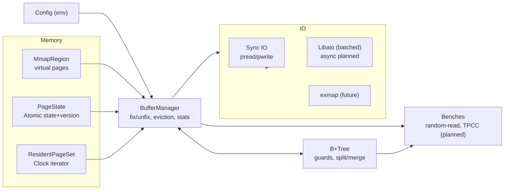
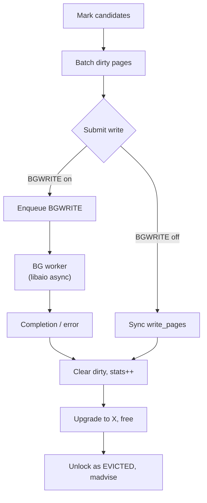

# FerricCache – Rust VMCache Port

⚡ A Rust reimplementation of the VMCache paper (SIGMOD’23 Virtual-Memory Assisted Buffer Management), aiming for upstream semantics with safe, idiomatic code and production-grade observability.

## Why It Matters
- VMCache shows how virtual memory primitives (mmap, madvise, exmap) can act as a high-performance buffer manager.  
- FerricCache brings that design to Rust: safer memory/FFI boundaries, clearer ownership, testable components, and modern tooling.  
- It can be dropped in as a buffer manager + B+tree index, or serve as a baseline for DB/benchmark experiments.

## Current Status
- Buffer manager: mmap region, PageState state machine, ResidentPageSet clock eviction, mark→write→upgrade→free (sync by default), PID free list, per-thread stats/worker_id, Send/Sync sharing.
- IO: PageIo abstraction; sync pread/pwrite default. `libaio` feature batches writes but still waits; BGWRITE has a queue + background thread with batching and saturation stats.
- Guards: GuardO/S/X with spin/yield backoff.
- B+tree: fences/prefix/hints; insert (split), scan, delete (borrow/merge, root shrink), duplicate overwrite; root PID via Arc<AtomicU64>, Send/Sync.
- Bench: multi-thread random-read microbenchmark (ordered load, parallel lookups, per-thread throughput + BGWRITE stats). Main binary initializes and prints stats.
- Tests: 19 passing unit tests (page state/eviction/batch write, B+tree CRUD+stress, BGWRITE config, worker_id, per-thread stats). `cargo test --tests --lib` green.

## VMCache Gap Snapshot
- IO/eviction: libaio path still sync-wait; BGWRITE not fully async (inflight tracking minimal), saturation handling basic.
- exmap: ioctl/interface pages/SEGV restart not implemented.
- Concurrency: worker_id not bound to IO resources; no park/notify backoff.
- B+tree: separator/fence/hint maintenance after borrow/merge can be tighter; more heavy mixed workloads needed.
- Bench/metrics: TPCC + periodic stats thread missing; random-read output minimal vs vmcache metrics.
- Storage/persistence: only PID free list; no segment/WAL/checkpoint (upstream also leaves this open).

## Architecture (Target Shape)
- `config`: env-driven knobs (`BLOCK`, `VIRTGB`, `PHYSGB`, `EXMAP`, `BATCH`, `THREADS`, `DATASIZE`, `RUNFOR`, `RNDREAD`, `BGWRITE`).
- `memory`: `Page`, `PageState` (atomic state+version), `ResidentPageSet` (open addressing + clock), `MmapRegion`.
- `buffer_manager`: owns region/states/resident set; fix/unfix S/X, alloc/fault, eviction with batching, IO submission, stats (global + per-thread + BGWRITE).
- `io`: sync file IO; libaio batch pwrite (to be made truly async); future exmap path.
- `btree`: vmcache-like node layout (prefix/fence/hints), optimistic/shared/exclusive guards, splits/merges, metadata page PID 0.
- `bench/bin`: random-read microbenchmark (present); TPCC driver + stats thread planned.

### Component Map

### Eviction / BGWRITE Pipeline (target)

## Roadmap (Prioritized)
1) **IO & Eviction Parity**  
   - Make BGWRITE truly async (bounded queue, inflight tracking, robust retries/fallback).  
   - Harden libaio: non-blocking submit + async reap with timeout/retry; keep sync fallback.  
   - Stress tests for batch write failures/saturation and eviction correctness.
2) **Concurrency Model**  
   - Wire `worker_id` into IO/exmap resources; add spin→yield→park backoff.  
   - Extend benchmarks with per-thread throughput/hit/fault stats.
3) **B+tree Balancing**  
   - Refine separator/fence/hint after borrow/merge; add heavier mixed insert/delete/scan tests.
4) **Exmap Path (feature-gated)**  
   - ioctl + interface pages + SEGV restart strategy; graceful disable when unsupported.
5) **Benchmarks & Metrics**  
   - Port TPCC; add periodic stats thread (hit/miss/evict/write batches/BGWRITE/libaio queue).  
   - Enrich random-read output (per-thread, hit-rate estimates).
6) **Optional Storage/Persistence**  
   - Segment/space management; WAL/checkpoint if DB semantics are desired.

## Open Questions
- Safe exmap fault handling in Rust (SEGV restart vs. pre-fault/EFAULT).
- libaio vs. optional io_uring feature.
- Whether to extend space management beyond PID free list (upstream leaves open).

## Acceptance Targets
- Non-exmap path passes functional tests: alloc/fault/evict, B+tree CRUD, random-read benchmark.  
- TPCC run produces stable stats.  
- exmap feature builds and runs on systems with the module installed.  
- Page state invariants hold under stress (no leaked locks; resident count matches physUsedCount).

## Key Behavioral Requirements to Preserve
- Page size 4096, PID is index into `virtMem`.
- `allocPage` increments `physUsedCount`, ensures free pages (evicts if >95% of phys), assigns PID, locks X, inserts into resident set, performs exmap alloc or marks dirty.
- `fixX`/`fixS`:
  - If Evicted, fault-in (read) then return.
  - If Marked/Unlocked, attempt to lock; Shared increments count or reuses Marked->S.
  - Yield/spin with `_mm_pause` equivalent.
- Eviction:
  - Clock over resident set in batches.
  - First pass marks Unlocked pages; Marked clean -> evict candidate; Marked dirty -> try S lock, enqueue for write.
  - Batch pwrite dirty pages; then try upgrade dirty pages to X for eviction; clean up: exmap FREE or madvise DONTNEED, remove from resident set, unlock as Evicted, decrement physUsedCount.
- IO:
  - Reads: pread on blockfd or exmap pread (using per-thread interface offset).
  - Writes: libaio batch pwrite; set dirty=false before submit.
- Concurrency:
  - `workerThreadId` thread-local, used for exmap interface and libaio slots.
  - OLC restarts on version mismatch or marked/evicted transitions; destructor checks enforce restart.
  - SIGSEGV handler (exmap path) restarts if fault address is inside virtMem.
- B+tree:
  - Prefix compression and fences; split separator selection with optional truncation.
  - Leaf split ordered fast path for random-read benchmark.
  - Merge of leaves when underfull (partial, inner merge TODO in upstream).

## Rust Mapping Notes
- Atomic semantics: use `AtomicU64` with `SeqCst`/`Acquire`/`Release` mirroring C++ (explicit where needed). Preserve CAS strong/weak loops.
- Thread-locals: `std::thread_local!` for workerThreadId.
- Unsafe boundary: page buffer is raw mapped memory; BTree nodes overlay it via pointers. Encapsulate unsafe blocks and add debug assertions matching upstream.
- FFI: `libc`, `libaio-sys` (or small custom bindings), and hand-written `exmap` bindings (ioctl numbers, structs, interface pages). Keep `no_std`? → No, stay in std for now.
- Signals: Rust cannot unwind across FFI safely; prefer `sigaction` that sets a flag and longjmp-like restart or switch to pre-fault strategy in exmap mode (design decision: provide a guarded read path and handle EFAULT by restart, rather than relying on SEGV unwinding).
